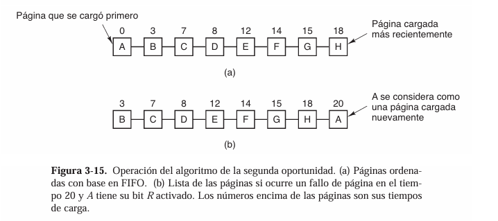
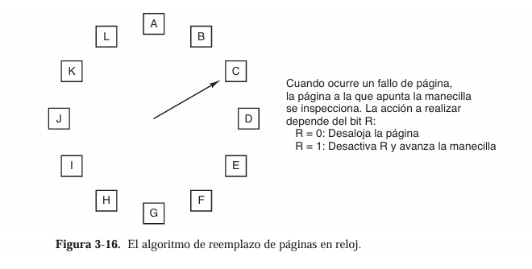
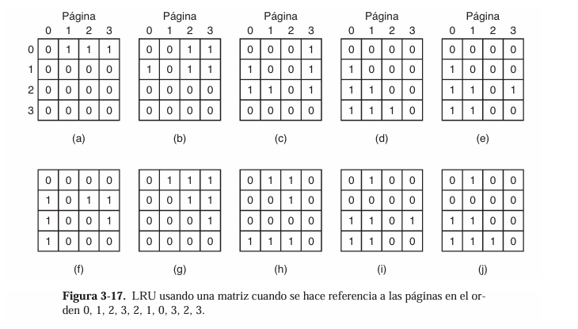
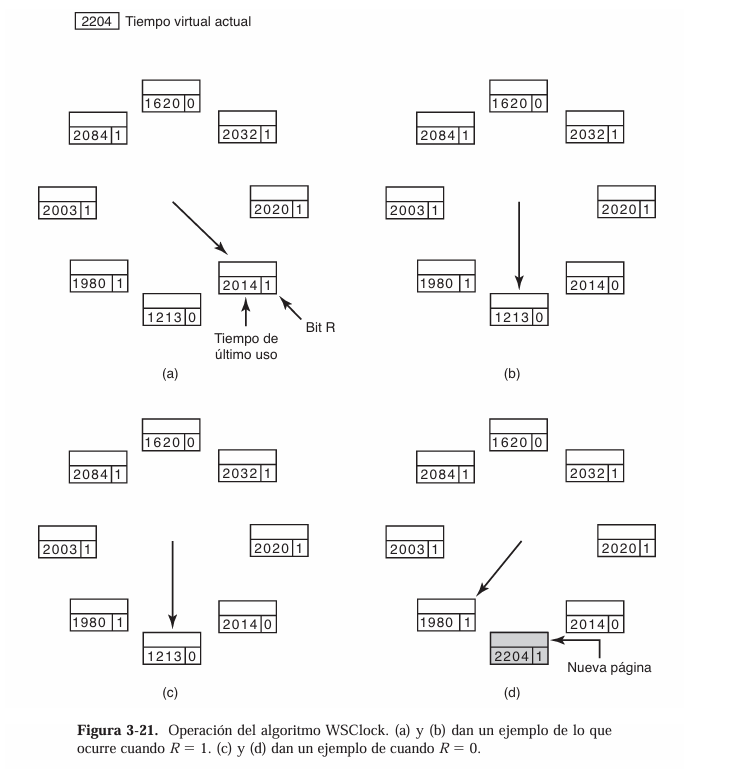
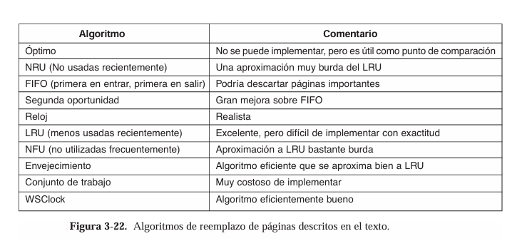
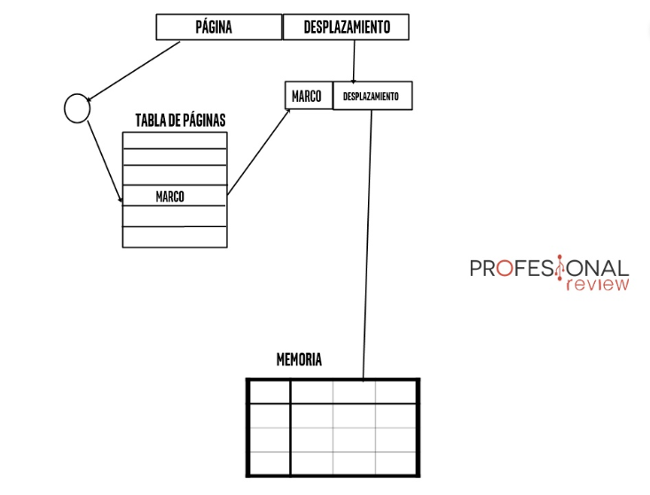
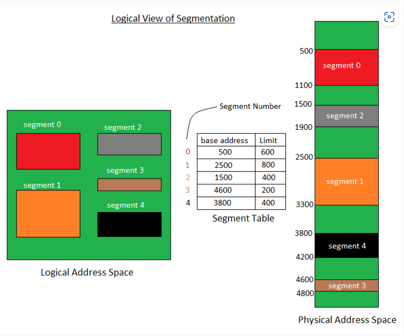
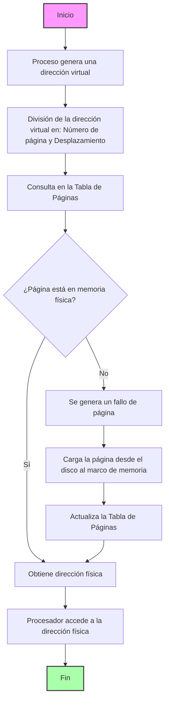

# **Administrador de Memoria**

## **3.1 Política y filosofía**

### ¿Cuál es la diferencia entre fragmentación interna y externa? Explica cómo cada una afecta el rendimiento de la memoria.

 La fragmentación se refiere al problema en la administración de memoria donde el espacio disponible en la memoria física o virtual se utiliza de manera ineficiente, dejando partes de la memoria inutilizables aunque haya suficiente espacio total para satisfacer las demandas de los procesos.

La **Fragmentación intrena** ocurre cuando la memoria asignada a un proceso es mayor que la requerida. Esto sucede porque la memoria se asigna en bloques fijos, y cualquier espacio sobrante dentro del bloque asignado no se puede usar por otros procesos, generando "desperdicio interno" (si un proceso necesita 6 KB de memoria y los bloques disponibles son de 8 KB, los 2 KB restantes no se pueden usar). Esto reduce la eficiencia de la memoria al desperdiciar espacio dentro de bloques asignados, además de limitar la cantidad de procesos que pueden ejecutarse simultáneamente, incluso si hay espacio total disponible.

La **fragmentación Externa** se produce cuando hay suficiente memoria libre para satisfacer una solicitud, pero está fragmentada en bloques no contiguos, lo que impide su uso. Es un problema de "espacios dispersos" en la memoria (si hay 10 KB libres en total, pero divididos en bloques de 3 KB, 4 KB y 3 KB, un proceso que necesita 7 KB no puede ejecutarse aunque haya espacio suficiente).Esto ocasiona que se pueda llevar un uso ineficiente de la memoria, ya que los bloques dispersos no contiguos no pueden ser utilizados para satisfacer solicitudes grandes, además de que obliga al sistema a recurrir a estrategias como la compactación de memoria, que implica mover datos y procesos en la memoria, lo que es costoso en tiempo de CPU.

 ### Investiga y explica las políticas de reemplazo de páginas en sistemas operativos. ¿Cuál consideras más eficiente y por qué?

La idea básica detrás de la memoria virtual es que cada programa tiene su propio espacio de direcciones, el cual se divide en trozos llamados páginas. Cada página es un rango contiguo de direcciones. Los algoritmos de reemplazo de páginas son utilizados para decidir qué páginas pueden ser sacadas de memoria cuando se necesita cargar una nueva y ya no hay marcos de páginas libres.

**No usadas recientemente**

El algoritmo NRU (Not Recently Used) utiliza dos bits, R (referenciado) y M (modificado), para clasificar las páginas de memoria en cuatro clases según su uso reciente y si han sido modificadas. Estas categorías son:

* Clase 0: No referenciada ni modificada.
* Clase 1: No referenciada pero modificada.
* Clase 2: Referenciada pero no modificada.
* Clase 3: Referenciada y modificada.

Cuando ocurre un fallo de página, el algoritmo selecciona para reemplazo una página de la clase de menor número disponible, favoreciendo las páginas menos importantes. Este método considera que es más eficiente eliminar una página modificada poco usada que una limpia de uso frecuente.

El bit R se borra periódicamente mediante interrupciones de reloj para identificar las páginas no utilizadas recientemente, mientras que el bit M solo se borra si una página es escrita nuevamente en disco.

El algoritmo NRU es sencillo, eficiente de implementar y ofrece un rendimiento aceptable aunque no óptimo, siendo una solución práctica para sistemas con memoria virtual limitada.

**Primera en entrar, primera en salir (FIFO)**

El algoritmo de reemplazo de páginas FIFO (First-In, First-Out) es un método simple que reemplaza la página que lleva más tiempo en memoria. El sistema operativo organiza las páginas en una lista en orden de llegada: la más reciente se coloca al final y la más antigua al frente. Ante un fallo de página, se elimina la página al frente de la lista y se agrega la nueva al final.

Aunque es fácil de implementar y tiene baja sobrecarga, FIFO puede generar reemplazos subóptimos, como eliminar páginas críticas que se usan frecuentemente, una limitación similar a decisiones erráticas en otros contextos (como reemplazar productos esenciales en un supermercado). Por este motivo, FIFO rara vez se utiliza en su forma pura.

**Segunda oportunidad**

El algoritmo de reemplazo de páginas de Segunda Oportunidad (o "Second Chance") es una mejora del algoritmo FIFO (First In, First Out) diseñado para reducir sus limitaciones. Este algoritmo evalúa si una página merece ser reemplazada basándose en un bit de referencia, su funiconamiento consiste en lo siguiente:

1. Cada página en memoria tiene asociado un bit de referencia, que se establece en 1 cada vez que la página es accedida.
2. Cuando se necesita liberar espacio debido a un fallo de página, el algoritmo revisa la página más antigua en la cola:
    * Si el bit de referencia de esta página está en 1, se interpreta como que la página ha sido usada recientemente. El algoritmo:
        * Cambia su bit de referencia a 0.
        * Mueve la página al final de la cola, dándole una "segunda oportunidad".
    * Si el bit de referencia está en 0, la página se considera no utilizada recientemente y se elimina.
3. Este proceso se repite hasta encontrar una página con el bit en 0.



**Reloj**

El algoritmo de reemplazo de páginas "reloj" (Clock) es una optimización del algoritmo de Segunda Oportunidad y se utiliza para gestionar el reemplazo de páginas en memoria. Este algoritmo organiza las páginas en memoria en un arreglo circular, similar a las posiciones de un reloj. Cada página tiene un bit asociado, llamado bit de uso, que indica si la página ha sido referenciada recientemente.

El puntero del "reloj" se mueve cíclicamente a través de las páginas en memoria. Cuando ocurre un fallo de página, el algoritmo revisa el bit de uso de la página señalada por el puntero. Si el bit de uso está en 0, significa que la página no ha sido utilizada recientemente y puede ser reemplazada. Si el bit de uso está en 1, se establece a 0, y el puntero avanza a la siguiente página en el arreglo, repitiendo este proceso hasta encontrar una página con el bit de uso en 0.



Esta técnica tiene varias ventajas: es sencilla de implementar, eficiente en el uso de recursos y una aproximación al algoritmo Least Recently Used (LRU), pero con menos sobrecarga computacional. Sin embargo, su rendimiento depende de la frecuencia de acceso y puede no ser ideal en sistemas con alta densidad de cambios en las páginas en memoria

**Menos usadas recientemente (LRU)**

El algoritmo de reemplazo de páginas Menos Usadas Recientemente (LRU) es una aproximación práctica al algoritmo óptimo, basado en la observación de que las páginas utilizadas recientemente tienen más probabilidades de ser usadas en el futuro cercano, mientras que las no referenciadas durante un tiempo prolongado probablemente sigan sin usarse. Cuando ocurre un fallo de página, LRU reemplaza la página que no ha sido utilizada durante el mayor tiempo.

Implementar LRU completamente es costoso debido a la necesidad de registrar cada acceso a memoria. Una implementación clásica utiliza una lista enlazada donde las páginas más recientemente usadas están al frente y las menos usadas al final. Actualizar esta lista en cada acceso a memoria puede ser computacionalmente intensivo.

Alternativas incluyen el uso de hardware especializado, como un contador que registra el tiempo de uso de cada página o matrices que representan el historial de accesos. Estas soluciones pueden simplificar la identificación de la página menos usada, aunque siguen siendo costosas en términos de hardware y recursos. Por ejemplo, una matriz de bits puede usarse para mantener un orden relativo de uso entre páginas, identificando fácilmente la página menos referenciada



**Conjunto de trabajo**

El concepto del conjunto de trabajo se refiere a un modelo en la gestión de memoria virtual que define el conjunto de páginas de memoria activamente utilizadas por un proceso durante un intervalo específico de tiempo. Este enfoque tiene como objetivo principal optimizar la eficiencia del sistema y reducir los fallos de página, asegurando que la cantidad de memoria asignada a un proceso sea suficiente para su ejecución sin excesivas interrupciones.

El conjunto de trabajo de un proceso se mide en función de un intervalo de tiempo reciente, usualmente mediante un parámetro denominado τ (tau), que indica la ventana de tiempo de observación. Durante esta ventana, las páginas referenciadas se consideran parte del conjunto de trabajo. Las páginas que no se hayan utilizado fuera de este periodo son expulsadas para liberar espacio en memoria.

Este modelo es especialmente útil en sistemas multitarea donde la memoria debe distribuirse entre múltiples procesos en ejecución. Cada proceso tiene un conjunto de trabajo que varía dinámicamente con su comportamiento. Si el conjunto de trabajo de un proceso crece y supera la cantidad de memoria disponible, se producen frecuentes fallos de página, lo que lleva a una degradación del rendimiento.

Beneficios del Modelo

1. Minimización de Fallos de Página: Al mantener las páginas necesarias en memoria, se evitan interrupciones causadas por accesos a disco.
2. Uso Eficiente de Memoria: Libera espacio de páginas inactivas, permitiendo que otros procesos lo utilicen.
3. Adaptabilidad Dinámica: Ajusta automáticamente los recursos asignados según las necesidades actuales de cada proceso.

Implementación y Algoritmos Relacionados.

El sistema operativo puede implementar el modelo del conjunto de trabajo mediante un algoritmo de reemplazo que rastrea las páginas usadas recientemente. Algunos ejemplos de implementación incluyen:
* El algoritmo de Conjunto de Trabajo puro, que registra todas las páginas referenciadas en el intervalo τ y mantiene en memoria solo estas páginas.
* Una aproximación basada en bits de referencia, donde cada página tiene un bit que se actualiza periódicamente para identificar su uso reciente.

En sistemas donde no se puede implementar directamente el modelo del conjunto de trabajo, se utilizan algoritmos aproximados como el NRU (Not Recently Used) o el algoritmo de reloj para manejar de manera efectiva la memoria virtual.

**WSClock**

El algoritmo WSClock es una versión mejorada del algoritmo de reloj que incorpora los conceptos del conjunto de trabajo. Su diseño se centra en abordar las limitaciones del algoritmo básico del conjunto de trabajo, como la necesidad de revisar exhaustivamente toda la tabla de páginas en cada fallo de página. Introducido por Carr y Hennessey en 1981, WSClock es conocido por su facilidad de implementación y rendimiento eficiente, lo que lo hace ampliamente utilizado en la práctica.

La estructura principal del WSClock es una lista circular de marcos de página, similar a la del algoritmo de reloj. Cada entrada en esta lista contiene información clave: el tiempo del último uso de la página, el bit de referencia (R), y un bit de modificación (M, no siempre mostrado). Cuando ocurre un fallo de página, el algoritmo comienza inspeccionando la página señalada por la "manecilla". Si el bit R está activado (1), indica que la página ha sido utilizada recientemente y no es un buen candidato para reemplazo. En este caso, el algoritmo apaga el bit R y avanza a la siguiente página.



Cuando se encuentra una página cuyo bit R está apagado (0), el algoritmo evalúa si la página es un candidato adecuado para ser reemplazada. Si la página tiene una edad mayor que el parámetro τ (indicando que no pertenece al conjunto de trabajo) y no está modificada (es decir, limpia), se puede reclamar inmediatamente. Por otro lado, si la página está modificada, se planifica una operación de escritura al disco, pero el algoritmo sigue buscando otra página que pueda reemplazarse sin retrasos.

Una característica importante del WSClock es su capacidad para manejar múltiples escrituras de páginas sucias de manera eficiente, limitando el número de páginas que se escriben al disco en un ciclo completo del reloj. Esto ayuda a reducir el tráfico de disco, evitando un impacto negativo en el rendimiento del sistema. En situaciones en las que no se encuentran páginas limpias en un ciclo completo, el algoritmo sigue avanzando, confiando en que las escrituras pendientes eventualmente marcarán algunas páginas como limpias para su desalojo.

El WSClock combina la simplicidad del algoritmo de reloj con las ventajas del modelo del conjunto de trabajo. Gracias a su diseño, puede optimizar la utilización de memoria y minimizar los fallos de página, lo que lo convierte en una solución eficaz para la gestión de memoria en sistemas operativos modernos.


**Algoritmo de envejecimiento**

El algoritmo de envejecimiento es una estrategia utilizada en la gestión de memoria de los sistemas operativos para reemplazar páginas de manera eficiente, emulando el comportamiento del algoritmo LRU (Least Recently Used) pero sin los costos asociados a su implementación exacta. Este algoritmo utiliza una estructura basada en contadores que registran de forma aproximada el uso reciente de las páginas.

Cada página en memoria tiene un contador asociado. En intervalos regulares de tiempo, todos los contadores se desplazan hacia la derecha (dividiendo efectivamente su valor por dos) y se añade al bit más significativo el valor del bit de referencia de la página, proporcionado por el hardware. Este bit indica si la página fue referenciada durante el último intervalo. Por lo tanto, las páginas más utilizadas recientemente tienen contadores con valores más altos, mientras que las menos utilizadas tienden a tener valores más bajos.

Cuando ocurre un fallo de página y se necesita liberar espacio, el sistema operativo examina los contadores de todas las páginas y elige para reemplazo aquella con el valor más bajo, ya que se considera la menos referenciada en los intervalos recientes. Este enfoque permite priorizar las páginas que probablemente no se necesitarán pronto, optimizando el rendimiento del sistema.

El algoritmo tiene ciertas limitaciones. Por ejemplo, la precisión depende del tamaño de los contadores (número de bits), lo que significa que sólo se puede rastrear el uso reciente dentro de un período limitado. Además, a diferencia de LRU, no permite identificar con precisión cuál fue la última página referenciada en cada momento, ya que los contadores sólo proporcionan una aproximación acumulativa del uso reciente.

Este método es útil porque ofrece un equilibrio entre la complejidad y el rendimiento. Aunque no es tan preciso como LRU, evita la necesidad de mantener listas o estructuras costosas y se puede implementar con un soporte de hardware básico para manejar los bits de referencia y realizar los desplazamientos periódicos.

**Análisis de los algoritmos**



Con todo, los dos mejores algoritmos son el de envejecimiento y WSClock. Se basan en LRU y el conjunto de trabajo, respectivamente. Ambos dan un buen rendimiento en la paginación y pueden implementarse con eficiencia. Existen varios algoritmos más, pero estos dos son tal vez los más importantes en la práctica.

## **3.2 Memoria Real**

### Escribe un programa en C o Python que simule la administración de memoria mediante particiones fijas.

(Profe lo hice en java, disculpe jijiji)

Primero creamos la clase "Proceso" que simulará a los procesos
```java 
public class Proceso {
    
    private int id;
    private int tamaño;

    public Proceso(int id, int tamaño) {
        this.id = id;
        this.tamaño = tamaño;
    }

    public Proceso() {
    }

    public int getId() {
        return id;
    }

    public void setId(int id) {
        this.id = id;
    }

    public int getTamaño() {
        return tamaño;
    }

    public void setTamaño(int tamaño) {
        this.tamaño = tamaño;
    }
    
}
```

Luego pasaremos a elaborar toda la lógica del programa

```java
import java.util.Scanner;

public class Simulador_administrador_memoria {

    static Scanner leer = new Scanner(System.in);
    static int tamañoMemoria;
    static Proceso[] particiones;
    static int[] tamañoParticiones;

    public static void main(String[] args) {
        inicializar_memoria();
        menu();
    }

    static void menu() {
        int op = 0;
        do {
            System.out.println("\n0.Salir.");
            System.out.println("1.Generar proceso");
            System.out.println("2.Liberar proceso");
            System.out.println("3.Mostrar espacio en la memoria");
            System.out.print("Seleccione una opcion: ");
            op = leer.nextInt();

            switch (op) {
                case 0:
                    System.out.println("Adios...");
                    return;
                case 1:
                    generar_proceso();
                    break;
                case 2:
                    liberar_proceso();
                    break;
                case 3:
                    mostrar_memoria();
                    break;
                default:
                    System.out.println("Opcion invalida, vuelva a intentar.");
                    ;
            }
        } while (op != 0);
    }

    private static void inicializar_memoria() {
        System.out.print("Digite tamano total de la memoria (KB): ");
        tamañoMemoria = leer.nextInt();
        System.out.print("Digite cantidad de particiones: ");
        particiones = new Proceso[leer.nextInt()];
        tamañoParticiones = new int[particiones.length];
        for (int i = 0; i < particiones.length; i++) {
            System.out.print("Ingrese tamano de la particion " + (i + 1) + " (KB): ");
            tamañoParticiones[i] = leer.nextInt();
        }
    }

    private static void generar_proceso() {
        System.out.print("\nDigite id del proceso: ");
        int id = leer.nextInt();
        System.out.print("Digite tamano del proceso (KB): ");
        int tamaño = leer.nextInt();
        
        boolean espacio = false;
        for (int i = 0; i < particiones.length && espacio == false; i++) {
            if (particiones[i] == null) {
                if (tamaño < tamañoParticiones[i]) {
                    particiones[i] = new Proceso(id, tamaño);
                    espacio = true;
                    System.out.println("Proceso " + id + " almacenado en la celda " + (i + 1));
                }
            }
        }
        if(!espacio){
            System.out.println("Error al guardar el proceso");
        }
    }

    
    private static void liberar_proceso() {
        mostrar_memoria();
        System.out.println("");
        System.out.print("Ingrese el ID DEL PROCESO que se desea eliminar: ");
        int eliminar = leer.nextInt();
        
        boolean eliminado = false;
        for(int i = 0; i < particiones.length; i++){
            if(particiones[i] != null){
                if(particiones[i].getId() == eliminar){
                    particiones[i] = null;
                    eliminado = true;
                    System.out.println("\nEliminado satisfactoriamente");
                }
            }
        }
        if(!eliminado){
            System.out.println("\nNo se encontro el proceso");
        }
    }

    private static void mostrar_memoria() {
        System.out.println("\nTamano total de la memoria: " + tamañoMemoria);
        System.out.println("Numero de particiones en memoria: " + particiones.length + " \n");
        for (int i = 0; i < particiones.length; i++) {
            if(particiones[i] == null){
                System.out.println("Particion " + (i+1) + " (" + tamañoParticiones[i] + " KB): libre");
            }else{
                System.out.println("Particion " + (i+1) + " (" + tamañoParticiones[i] + " KB): proceso " + particiones[i].getId() + " ( " + particiones[i].getTamaño() + " KB)");
            }
        }
    }
}

```

### Diseña un algoritmo para calcular qué procesos pueden ser asignados a un sistema con memoria real limitada utilizando el algoritmo de "primera cabida".

```java
import java.util.ArrayList;
import java.util.List;

public class PrimeraCabida {

    static class Proceso {
        int id;
        int tamaño;

        public Proceso(int id, int tamaño) {
            this.id = id;
            this.tamaño = tamaño;
        }
    }

    public static void main(String[] args) {
        int[] particiones = {100, 500, 200, 300, 600}; 
        List<Proceso> procesos = new ArrayList<>();
        procesos.add(new Proceso(1, 212));
        procesos.add(new Proceso(2, 417));
        procesos.add(new Proceso(3, 112));
        procesos.add(new Proceso(4, 426));

        asignarProcesos(particiones, procesos);
    }

    public static void asignarProcesos(int[] particiones, List<Proceso> procesos) {
        int[] asignaciones = new int[procesos.size()];
        for (int i = 0; i < asignaciones.length; i++) {
            asignaciones[i] = -1; 
        }

        for (int i = 0; i < procesos.size(); i++) {
            Proceso proceso = procesos.get(i);

            for (int j = 0; j < particiones.length; j++) {
                if (particiones[j] >= proceso.tamaño) {
                    asignaciones[i] = j; 
                    particiones[j] -= proceso.tamaño; 
                    break;
                }
            }
        }

        System.out.println("Asignación de procesos:");
        for (int i = 0; i < procesos.size(); i++) {
            Proceso proceso = procesos.get(i);
            if (asignaciones[i] != -1) {
                System.out.println("Proceso " + proceso.id + " (" + proceso.tamaño + " KB) -> Partición " + (asignaciones[i] + 1));
            } else {
                System.out.println("Proceso " + proceso.id + " (" + proceso.tamaño + " KB) -> No asignado");
            }
        }
    }
}

```

## **3.3 Organización de memoria virtual**

### Investiga y explica el concepto de "paginación" y "segmentación". ¿Cuáles son las ventajas y desventajas de cada técnica?

**Paginación**

Se trata de un modelo de organización de memoria física en el que se divide toda la memoria en porciones del mismo tamaño. Esas porciones reciben el nombre de marcos o páginas físicas. Si dividimos la memoria en páginas, podremos gestionarla mejor.

Los marcos se identifican con un número que se denomina «número de página física«. A su vez, cada página física se asigna a un proceso de forma exclusiva. Por otro lado, cada proceso tiene un espacio de páginas lógicas, y cada una se mapea o se asocia a un marco.

 

La tabla de páginas es el mapeo resultante entre páginas lógicas y físicas (Mapeado: asignación de una página lógica o física a un proceso. Ocurre igual que en los videojuegos cuando asignamos una tecla a una acción.). Por tanto, cada proceso tiene su tabla de páginas. Luego, hay que entender que el proceso tiene un direccionamiento lógico que usará para satisfacer sus necesidades. 

¿Cómo funciona?

Debemos hacer referencia a sus dos funciones claras: 
1. Transforma una dirección virtual a física.
2. Transfiere páginas de la memoria secundaria a la memoria principal y viceversa.

En esta técnica de gestión de memoria, los programas se dividen en unidades lógicas llamadas «páginas«. Estas páginas se usan como unidad de almacenamiento de información, como también para transferir entre la memoria principal y la secundaria. 

La memoria física se divide en páginas, que son bloques del mismo tamaño. Recordad que la memoria dividida en bloques = marcos; el proceso dividido en bloques = páginas. De este modo, los marcos y las páginas tienen un tamaño fijo, ya que es la premisa de la paginación. La paginación usa 2 posibles estructuras de datos:
* Tabla de páginas: Guarda la dirección del marco en la que está almacenada cada página. Existe una tabla por proceso y tantas entradas como páginas tiene éste. Transforma direcciones virtuales o lógicas a físicas. 
* Lista de marcos libres. Guarda los marcos sin asignar, habiendo una tabla para todo el sistema (no para cada proceso). Hay entradas como marcos libres.

Cada dirección lógica contiene 2 cosas: el número de página y el desplazamiento.

**Segmentación**

Un proceso se divide en Segmentos. Los fragmentos en los que se divide un programa, que no son necesariamente del mismo tamaño, se denominan segmentos. La segmentación le da al usuario una vista del proceso que no da la paginación. Aquí la vista del usuario se asigna a la memoria física.
Hay tipos de segmentación:
1. Segmentación de la memoria virtual: cada proceso se divide en una serie de segmentos, no todos los cuales residen en un momento determinado.
2. cada proceso se divide en varios segmentos, todos los cuales se cargan en la memoria en tiempo de ejecución, aunque no necesariamente de forma contigua.

No existe una relación simple entre las direcciones lógicas y las direcciones físicas en la segmentación. Una tabla almacena la información sobre todos esos segmentos y se denomina tabla de segmentos.

**Tabla de segmentos:** asigna una dirección lógica bidimensional a una dirección física unidimensional. Cada entrada de la tabla tiene:
1. Dirección base: contiene  la dirección física inicial donde residen los segmentos en la memoria.
2. Límite: Especifica la longitud del segmento.



### Escribe un programa que simule una tabla de páginas para procesos con acceso aleatorio a memoria virtual.

Este programa simula el comportamiento de una tabla de páginas en un sistema que utiliza memoria virtual, emulando cómo se gestionan las páginas y los marcos en la memoria física. En su inicio, se recopilan datos del usuario, como el número de marcos disponibles en memoria física, el total de páginas del proceso, y la cantidad de accesos aleatorios que se quieren simular. Una vez recopilados los datos, el programa configura una tabla para representar las páginas del proceso, inicialmente vacía, junto con una estructura que simula los marcos disponibles en la memoria física.

Durante la simulación, se generan accesos aleatorios a páginas virtuales. Si una página solicitada no está cargada en la memoria física, ocurre un fallo de página. En este caso, el programa verifica si hay espacio disponible en la memoria física; si no hay espacio, utiliza una política de reemplazo basada en el principio de "Primero en entrar, primero en salir" (FIFO) para liberar un marco y cargar la nueva página en memoria. Cada fallo de página se cuenta y registra. Si la página ya está cargada, se indica que el acceso puede realizarse sin problemas.

Al finalizar, se muestran los resultados de la simulación. Estos incluyen el número total de fallos de página, una lista de los accesos realizados durante la simulación, y el estado final de la tabla de páginas, indicando qué páginas están cargadas en memoria física y en qué marcos se encuentran. Esto proporciona una visión clara del comportamiento del sistema en términos de gestión de memoria virtual frente a los accesos aleatorios realizados.

```java
import java.util.*;

public class TablaPaginas {
    
    static int numMarcos;
    static int numPaginas;
    static int numAccesos;
    static Integer[] tablaPaginas;
    static Queue<Integer> memoriaFisica;
    static int fallosDePagina;
    static List<Integer> accesosRealizados;

    public static void main(String[] args) {
        inicializar_datos();
        tabla_procesos();
        mostrar_resultados();
    }

    public static void inicializar_datos() {
        Scanner scanner = new Scanner(System.in);

        System.out.print("Ingrese el número de marcos disponibles en memoria física: ");
        numMarcos = scanner.nextInt();

        System.out.print("Ingrese el número de páginas en el proceso: ");
        numPaginas = scanner.nextInt();

        System.out.print("Ingrese el número de accesos aleatorios a simular: ");
        numAccesos = scanner.nextInt();

        tablaPaginas = new Integer[numPaginas];
        Arrays.fill(tablaPaginas, null); 
        memoriaFisica = new LinkedList<>();
        fallosDePagina = 0;
        accesosRealizados = new ArrayList<>();
    }

    public static void tabla_procesos() {
        Random random = new Random();

        System.out.println("\nSimulación de accesos aleatorios:");
        for (int i = 0; i < numAccesos; i++) {
            int paginaAccedida = random.nextInt(numPaginas);
            accesosRealizados.add(paginaAccedida);
            System.out.println("Acceso a la página virtual: " + paginaAccedida);

            if (tablaPaginas[paginaAccedida] == null) {
                fallosDePagina++;
                System.out.println("Fallo de página. Cargando página " + paginaAccedida + " en memoria.");
                if (memoriaFisica.size() >= numMarcos) {
                    int paginaReemplazada = memoriaFisica.poll();
                    System.out.println("Reemplazando página: " + paginaReemplazada);
                    tablaPaginas[paginaReemplazada] = null;
                }
                memoriaFisica.add(paginaAccedida);
                tablaPaginas[paginaAccedida] = memoriaFisica.size() - 1;
            } else {
                System.out.println("Página ya está cargada en memoria (marco físico: " + tablaPaginas[paginaAccedida] + ").");
            }
        }
    }

    public static void mostrar_resultados() {
        System.out.println("\nSimulación finalizada.");
        System.out.println("Total de fallos de página: " + fallosDePagina);

        System.out.println("\nAccesos realizados:");
        for (int acceso : accesosRealizados) {
            System.out.print(acceso + " ");
        }
        System.out.println();

        System.out.println("\nTabla de páginas final:");
        for (int i = 0; i < numPaginas; i++) {
            if (tablaPaginas[i] != null) {
                System.out.println("Página " + i + " -> Marco físico " + tablaPaginas[i]);
            } else {
                System.out.println("Página " + i + " -> No cargada");
            }
        }
    }
}

```

## **3.4 Administrador de memoria virtual**

### Escribe un código que implemente el algoritmo de reemplazo de página "Least Recently Used" (LRU).

```java
import java.util.*;

public class AlgoritmoLRU {

    static int numMarcos; 
    static int[] secuenciaPaginas; 
    static List<Integer> memoria;
    static Map<Integer, Integer> ultimaReferencia; 
    static int fallosDePagina; 

    public static void main(String[] args) {
        inicializar_datos();   
        realizar_simulacion(); 
        mostrar_resultados();  
    }

    public static void inicializar_datos() {
        Scanner scanner = new Scanner(System.in);

        System.out.print("Ingrese el número de marcos en memoria: ");
        numMarcos = scanner.nextInt();

        System.out.print("Ingrese la secuencia de accesos a páginas (separadas por espacio): ");
        scanner.nextLine(); 
        String[] input = scanner.nextLine().split(" ");
        secuenciaPaginas = Arrays.stream(input).mapToInt(Integer::parseInt).toArray();

        memoria = new ArrayList<>();
        ultimaReferencia = new HashMap<>();
        fallosDePagina = 0;
    }

    public static void realizar_simulacion() {
        System.out.println("\nSimulación del algoritmo LRU:");

        for (int i = 0; i < secuenciaPaginas.length; i++) {
            int pagina = secuenciaPaginas[i];
            System.out.println("Acceso a la página virtual: " + pagina);

            if (!memoria.contains(pagina)) {
                fallosDePagina++;
                System.out.println("Fallo de página. Cargando página " + pagina + " en memoria.");

                if (memoria.size() >= numMarcos) {
                    int lru = Collections.min(ultimaReferencia.entrySet(), Comparator.comparingInt(Map.Entry::getValue)).getKey();
                    System.out.println("Reemplazando página menos recientemente usada: " + lru);
                    memoria.remove(Integer.valueOf(lru));
                }

                memoria.add(pagina); 
            } else {
                System.out.println("Página " + pagina + " ya está en memoria.");
            }

            ultimaReferencia.put(pagina, i);

            System.out.println("Estado actual de la memoria: " + memoria);
        }
    }

    public static void mostrar_resultados() {
        System.out.println("\nResultados finales de la simulación:");
        System.out.println("Número total de fallos de página: " + fallosDePagina);
        System.out.println("Estado final de los marcos en memoria: " + memoria);
    }
}
```

### Diseña un diagrama que represente el proceso de traducción de direcciones virtuales a físicas en un sistema con memoria virtual.



## **Integración**

### Analiza un sistema operativo moderno (por ejemplo, Linux o Windows) e identifica cómo administra la memoria virtual.

Linux administra la memoria virtual utilizando un sistema avanzado que combina técnicas como la paginación, el uso de espacio de intercambio (swap) y la paginación por demanda

1. **Memoria Virtual y Paginación**
Linux utiliza la memoria virtual para permitir que los procesos usen más memoria de la que está disponible físicamente en la RAM. Este mecanismo se basa en dividir la memoria en bloques de tamaño fijo llamados *páginas*. Cada proceso tiene un espacio de direcciones virtuales que se asigna a la memoria física mediante tablas de páginas. Cuando un proceso necesita más memoria de la que tiene disponible en RAM, Linux puede trasladar páginas inactivas al espacio de intercambio (swap) en disco para liberar espacio en RAM para las páginas activas.

2. **Paginación por Demanda**
En lugar de cargar todas las páginas de un proceso en la memoria de una vez, Linux utiliza una técnica llamada *paginación por demanda*. Esto significa que las páginas solo se cargan en la RAM cuando son necesarias. Si un proceso intenta acceder a una página que no está en memoria, se produce una *fallo de página*, lo que desencadena que Linux cargue la página desde el disco (del espacio de intercambio) hacia la memoria física. Este enfoque permite que Linux gestione la memoria de manera eficiente, usando solo las páginas que realmente se necesitan en cada momento.

3. **Espacio de Intercambio (Swap)**
Linux puede utilizar tanto particiones de swap como archivos de swap. Las particiones de swap son áreas dedicadas del disco que se reservan específicamente para la memoria virtual, mientras que los archivos de swap son archivos normales en el sistema de archivos que se utilizan con el mismo propósito. El tamaño del espacio de intercambio es importante; un espacio de intercambio pequeño puede provocar problemas de memoria insuficiente, mientras que un espacio de intercambio demasiado grande puede reducir el rendimiento del sistema, ya que acceder al disco es mucho más lento que acceder a la RAM. El kernel de Linux gestiona dinámicamente qué datos se deben intercambiar entre la RAM y el disco según las necesidades de memoria del sistema.

4. **Swappiness (Nivel de Swap)**
El parámetro *swappiness* en Linux determina con qué agresividad el sistema debería utilizar el espacio de intercambio. Este parámetro varía entre 0 y 100, donde un valor bajo indica que el sistema intentará evitar usar swap, manteniendo las páginas en RAM tanto como sea posible. Un valor alto hará que Linux comience a intercambiar las páginas de memoria con mayor rapidez. El valor por defecto de *swappiness* en la mayoría de las distribuciones es 60, lo que indica que el sistema comenzará a utilizar swap cuando el uso de la RAM alcance aproximadamente el 60%.

5. **Estrategias de Reemplazo de Páginas**
Cuando el sistema necesita liberar espacio en la RAM, Linux utiliza varias estrategias para determinar qué páginas deben intercambiarse. Una de las más comunes es el algoritmo de *Least Recently Used* (LRU), que intenta intercambiar las páginas que no se han utilizado recientemente. Además, Linux monitorea las páginas marcándolas como "sucias" (modificadas) o "limpias" (no modificadas). Las páginas sucias deben escribirse en el disco antes de ser intercambiadas para evitar la pérdida de datos.

En resumen, Linux gestiona la memoria virtual mediante la paginación, el uso de espacio de intercambio y la paginación por demanda. El kernel de Linux optimiza el uso de la memoria física y virtual mediante parámetros como *swappiness* y algoritmos de reemplazo de páginas, asegurando que el sistema pueda manejar múltiples procesos y cargas de trabajo de manera eficiente. Además, la gestión dinámica de las páginas, el uso de espacio de intercambio y el intercambio de páginas entre RAM y disco contribuyen a que Linux sea un sistema operativo robusto y flexible para una amplia variedad de entornos.

### Realiza una simulación en cualquier lenguaje de programación que emule el swapping de procesos en memoria virtual. 

```java
import java.util.*;

public class SimulacionSwapping {

    static int numMarcos;
    static int numProcesos;
    static int[] procesos; 
    static List<Integer> memoriaFisica; 
    static int[] tablaDePaginas; 
    static int fallosDePagina;
    static int swapCount;

    public static void main(String[] args) {
        inicializar_datos();        
        simular_swapping();         
        mostrar_resultados();   
    }

    public static void inicializar_datos() {
        Scanner scanner = new Scanner(System.in);

        System.out.print("Ingrese el número de marcos en memoria: ");
        numMarcos = scanner.nextInt();

        System.out.print("Ingrese el número de procesos: ");
        numProcesos = scanner.nextInt();

        procesos = new int[numProcesos];
        System.out.println("Ingrese los identificadores de los procesos:");
        for (int i = 0; i < numProcesos; i++) {
            procesos[i] = scanner.nextInt();
        }

        memoriaFisica = new ArrayList<>();
        tablaDePaginas = new int[numProcesos]; 
        Arrays.fill(tablaDePaginas, -1); 
        fallosDePagina = 0;
        swapCount = 0;
    }

    public static void simular_swapping() {
        Random random = new Random();
        System.out.println("\nSimulación de swapping de procesos:");

        for (int i = 0; i < numProcesos; i++) {
            int proceso = procesos[i];
            System.out.println("Acceso al proceso " + proceso);

            if (!memoriaFisica.contains(proceso)) {
                fallosDePagina++;
                System.out.println("Fallo de página. Cargando proceso " + proceso + " en memoria.");

                if (memoriaFisica.size() < numMarcos) {
                    memoriaFisica.add(proceso);
                } else {
                    int procesoAReemplazar = memoriaFisica.get(0); 
                    memoriaFisica.remove(0); 
                    memoriaFisica.add(proceso); 
                    swapCount++;
                    System.out.println("Swap realizado: Se reemplazó el proceso " + procesoAReemplazar + " por el proceso " + proceso);
                }
            } else {
                System.out.println("Proceso " + proceso + " ya está en memoria.");
            }

            tablaDePaginas[proceso % numProcesos] = memoriaFisica.indexOf(proceso);
            System.out.println("Estado actual de la memoria: " + memoriaFisica);
        }
    }

    public static void mostrar_resultados() {
        System.out.println("\nSimulación finalizada.");
        System.out.println("Número total de fallos de página: " + fallosDePagina);
        System.out.println("Número de swaps realizados: " + swapCount);
        System.out.println("Estado final de los procesos en memoria: " + memoriaFisica);
    }
}

```

# **Administrador de Entradas/Salidas**

## **4.1 Dispositivos y manejadores de dispositivos**

### Explica la diferencia entre dispositivos de bloque y dispositivos de carácter. Da un ejemplo de cada uno.

**Dispositivos de Bloque**

Un dispositivo de bloque es un tipo de dispositivo de entrada/salida que maneja datos en bloques, es decir, en unidades fijas de datos, normalmente de tamaño constante. Los dispositivos de bloque permiten el acceso aleatorio a los datos, lo que significa que cualquier bloque de datos puede ser leído o escrito sin tener que procesar los bloques anteriores. Estos dispositivos son capaces de almacenar datos de forma persistente, y su principal característica es que gestionan grandes cantidades de datos en bloques homogéneos.

El manejo de los datos en bloques se traduce en una forma estructurada y eficiente de organizar la información. Cada bloque tiene una dirección única y se puede acceder directamente mediante esta dirección, lo que facilita las operaciones de lectura y escritura. Este tipo de dispositivo permite operaciones como la lectura o escritura en cualquier parte de los datos almacenados sin necesidad de procesar los datos secuenciales, lo que lo hace muy eficiente en términos de tiempo de acceso.

Los dispositivos de bloque son comúnmente usados para almacenar datos en discos duros, discos sólidos (SSD), y otros dispositivos de almacenamiento masivo. Estos dispositivos están diseñados para manejar grandes cantidades de información de manera rápida y eficiente, lo que los hace adecuados para tareas que requieren el acceso a grandes volúmenes de datos, como bases de datos y sistemas de archivos.

En términos de funcionamiento, el sistema operativo maneja los dispositivos de bloque mediante el uso de sistemas de archivos. Un sistema de archivos es una estructura que organiza y gestiona cómo se almacenan y recuperan los datos en los dispositivos de bloque. Los sistemas de archivos permiten dividir los datos en bloques y organizar los bloques de manera que sea fácil localizarlos y acceder a ellos.

Un ejemplo clásico de un dispositivo de bloque es un disco duro (HDD). En un disco duro, los datos se organizan en bloques de tamaño fijo (por ejemplo, 512 bytes o 4 KB), y el sistema operativo puede acceder a cualquier bloque específico sin necesidad de recorrer los bloques anteriores. Además, los discos duros permiten la lectura y escritura aleatoria de los datos, lo que mejora la eficiencia y la velocidad de las operaciones de E/S.

**Dispositivos de Carácter**

Un dispositivo de carácter es un tipo de dispositivo de entrada/salida que maneja los datos de forma secuencial, es decir, los datos se transmiten en un flujo continuo, sin estar organizados en bloques de tamaño fijo. Estos dispositivos suelen funcionar en una forma de acceso secuencial, lo que significa que los datos deben ser procesados en el orden en que son leídos o escritos. A diferencia de los dispositivos de bloque, los dispositivos de carácter no permiten un acceso aleatorio a los datos.

Los dispositivos de carácter son utilizados para tareas en las que la secuencia de datos es importante, y las operaciones de entrada/salida son realizadas de manera continua. Estos dispositivos son más simples en su diseño y funcionamiento en comparación con los dispositivos de bloque, pero se utilizan ampliamente en aplicaciones donde la cantidad de datos no es tan grande o no se requiere un acceso rápido o aleatorio.

Los dispositivos de carácter se utilizan comúnmente en entradas y salidas de datos en tiempo real, como teclados, ratones, impresoras, terminales de texto, puertos serie, y muchos otros. Estos dispositivos no almacenan datos, sino que simplemente envían o reciben flujos de datos. El procesamiento de la información es más directo y simple, pero generalmente no está optimizado para manejar grandes volúmenes de datos de manera eficiente.

En cuanto al manejo de los dispositivos de carácter, el sistema operativo generalmente los trata como un flujo continuo de datos, utilizando buffers (memorias temporales) para almacenar los datos mientras se están procesando. Debido a su naturaleza secuencial, la mayoría de las operaciones de entrada/salida con dispositivos de carácter son relativamente sencillas y no requieren estructuras complejas como las utilizadas en los dispositivos de bloque.

Un ejemplo típico de un dispositivo de carácter es un teclado. En un teclado, los datos se envían al sistema en forma de caracteres secuenciales, uno por uno, y el sistema los procesa en ese mismo orden. A diferencia de un dispositivo de bloque, un teclado no almacena datos en bloques ni permite un acceso aleatorio a la información; simplemente transmite un flujo continuo de entradas que el sistema debe procesar secuencialmente.

**Diferencias**

* Acceso a los datos: Los dispositivos de bloque permiten acceso aleatorio a los datos, lo que significa que los bloques de datos se pueden leer o escribir en cualquier orden. En cambio, los dispositivos de carácter sólo permiten acceso secuencial a los datos, es decir, los datos se procesan en el orden en que son recibidos o enviados.
* Tipo de datos procesados: Los dispositivos de bloque manejan grandes cantidades de datos que están organizados en bloques de tamaño fijo. Estos bloques son unidades de datos independientes que pueden ser gestionadas individualmente. En cambio, los dispositivos de carácter transmiten datos de forma secuencial, generalmente en un flujo continuo, como caracteres o señales.
* Uso principal: Los dispositivos de bloque son ideales para almacenamiento masivo de datos, como discos duros, SSDs y sistemas de archivos. Son utilizados en situaciones donde se requiere acceso rápido y eficiente a grandes cantidades de información. Por otro lado, los dispositivos de carácter son utilizados para tareas de entrada/salida en tiempo real, como el teclado, ratón o impresora, donde el flujo de datos es continuo y secuencial.
* Estructura interna: Los dispositivos de bloque organizan los datos en bloques estructurados y gestionados por el sistema operativo, lo que facilita las operaciones de lectura y escritura aleatoria. En cambio, los dispositivos de carácter no tienen una estructura interna de bloques, y los datos son transmitidos de manera continua y secuencial sin una organización estructurada.

### Diseña un programa que implemente un manejador de dispositivos senmcillo para un dispositivo virtual de entrada.

```java
import java.util.LinkedList;
import java.util.Queue;

class DispositivoEntradaVirtual {
    private Queue<String> buffer;

    public DispositivoEntradaVirtual() {
        buffer = new LinkedList<>();
    }

    public void generarDatos(String dato) {
        buffer.offer(dato);
        System.out.println("Dato generado: " + dato);
    }

    public String leerDato() {
        if (buffer.isEmpty()) {
            return "No hay datos disponibles en el dispositivo.";
        }
        return buffer.poll();
    }

    public boolean hayDatos() {
        return !buffer.isEmpty();
    }
}

class ManejadorDispositivo {
    private DispositivoEntradaVirtual dispositivo;

    public ManejadorDispositivo(DispositivoEntradaVirtual dispositivo) {
        this.dispositivo = dispositivo;
    }

    public void manejarSolicitud() {
        if (dispositivo.hayDatos()) {
            String dato = dispositivo.leerDato();
            System.out.println("Dato procesado por el manejador: " + dato);
        } else {
            System.out.println("No hay datos para procesar.");
        }
    }
}

public class ManejadorDispositivoSimulacion {
    public static void main(String[] args) {
        DispositivoEntradaVirtual dispositivo = new DispositivoEntradaVirtual();

        ManejadorDispositivo manejador = new ManejadorDispositivo(dispositivo);
        dispositivo.generarDatos("A");
        dispositivo.generarDatos("B");
        dispositivo.generarDatos("C");

        System.out.println("\nIniciando manejo de solicitudes:");

        manejador.manejarSolicitud(); 
        manejador.manejarSolicitud(); 
        manejador.manejarSolicitud(); 
        manejador.manejarSolicitud(); 
    }
}

```
 
## **4.2 Mecanismos y funciones de los manejadores de dispositivos**

### Investiga qué es la interrupción por E/S y cómo la administra el sistema operativo. Escribe un ejemplo en pseudocódigo para simular este proceso.

**¡Qué es la interrupción por E/S?**

Una interrupción por entrada/salida (E/S) es un mecanismo que permite a los dispositivos de hardware notificar al sistema operativo que una operación de entrada o salida ha terminado o requiere atención inmediata. Las interrupciones son señales enviadas al procesador por un dispositivo de hardware o software para indicar que se necesita un cambio en el flujo normal de ejecución. Este mecanismo es fundamental para coordinar las operaciones entre el CPU y los dispositivos de hardware sin que el procesador tenga que esperar activamente a que el dispositivo complete una tarea, optimizando así los recursos del sistema.

El funcionamiento básico de una interrupción por E/S se puede dividir en varios pasos. Primero, un dispositivo de hardware, como un disco duro o una impresora, completa una operación de entrada/salida o detecta un evento que necesita ser procesado (por ejemplo, datos listos para ser enviados o recibidos). Luego, el dispositivo envía una señal de interrupción al procesador a través de un controlador de interrupciones. Este controlador organiza y prioriza las interrupciones para garantizar que se gestionen en un orden lógico y eficiente.

Las interrupciones son esenciales para mejorar la eficiencia del sistema, ya que permiten que el procesador se concentre en otras tareas mientras el dispositivo de hardware completa su operación. En un sistema sin interrupciones, el procesador tendría que utilizar un enfoque de sondeo (polling), verificando constantemente si un dispositivo ha completado su operación, lo que resulta ineficiente y consume recursos innecesarios.

Además de mejorar la eficiencia, las interrupciones también son fundamentales para la multitarea y la gestión de recursos en sistemas operativos modernos. Permiten que el procesador interactúe de manera dinámica con múltiples dispositivos y procesos al mismo tiempo. Esto es especialmente importante en sistemas con múltiples programas o tareas en ejecución simultáneamente, ya que las interrupciones aseguran que los recursos estén disponibles para las tareas prioritarias cuando sea necesario.

Un aspecto crucial de las interrupciones por E/S es su manejo por parte del sistema operativo. Cada tipo de interrupción tiene un identificador único que ayuda al sistema operativo a determinar qué tipo de evento ocurrió y qué acción debe tomarse. Por ejemplo, una interrupción de un teclado puede requerir que el sistema operativo lea un carácter ingresado, mientras que una interrupción de un disco duro puede requerir que se procese un bloque de datos.

**Manejo de interrupciones por E/S**

El manejo de interrupciones por E/S es una de las tareas más importantes del sistema operativo, ya que asegura que los dispositivos de hardware puedan interactuar con el procesador de manera eficiente y sin conflictos. Este proceso generalmente involucra varias etapas y componentes clave.

Recepción de la interrupción: Cuando un dispositivo genera una señal de interrupción, esta es captada por el controlador de interrupciones del sistema. Este controlador es un componente de hardware que se encarga de gestionar las señales provenientes de varios dispositivos y priorizarlas si hay múltiples interrupciones simultáneas. El sistema operativo utiliza un mecanismo de prioridades para decidir cuál interrupción debe ser atendida primero.

Cambio de contexto: Cuando el procesador recibe una señal de interrupción, detiene temporalmente la ejecución de su tarea actual. Este proceso se llama cambio de contexto y permite que el procesador guarde el estado actual del programa en ejecución para poder retomarlo más tarde sin perder datos ni progreso.

Ejecución del manejador de interrupciones: El sistema operativo tiene un conjunto de rutinas predefinidas llamadas manejadores de interrupciones o controladores de interrupciones. Estas rutinas se encargan de procesar las solicitudes específicas de cada tipo de interrupción. Por ejemplo, un manejador de interrupciones para un disco duro puede iniciar la transferencia de datos desde un buffer a la memoria principal.

Finalización y reanudación: Una vez que el manejador de interrupciones ha procesado la señal y completado la acción necesaria, el procesador reanuda la tarea que estaba ejecutando antes de la interrupción. Esto se realiza mediante la restauración del estado guardado durante el cambio de contexto.

Optimización y priorización: Los sistemas operativos modernos optimizan este proceso mediante técnicas como la agrupación de interrupciones similares, el uso de interrupciones enmascarables (que pueden ser ignoradas temporalmente) y la delegación de tareas a procesadores secundarios en sistemas multiprocesadores.

El manejo eficiente de las interrupciones es esencial para evitar problemas como la saturación del procesador, los cuellos de botella en el rendimiento del sistema, y la pérdida de datos en dispositivos de alta velocidad. Además, asegura que las tareas críticas se gestionen con la prioridad adecuada, manteniendo el sistema operativo estable y receptivo.

```
# Inicialización del sistema
InicializarControladorDeInterrupciones()

# Simulación de una operación de entrada
Teclado.generarInterrupcion()

# Rutina principal del procesador
Mientras (SistemaEnEjecucion):
    Si hayInterrupcion():
        manejadorInterrupcion = obtenerManejador(InterrupcionActual)
        manejadorInterrupcion()  # Ejecuta la rutina específica de interrupción
    FinSi
    EjecutarTareaActual()  # Continúa con la tarea previa
FinMientras

# Manejador de interrupciones para el teclado
Funcion ManejadorTeclado():
    dato = Teclado.leerDato()  # Leer el carácter del buffer del teclado
    agregarALaColaDeEventos(dato)  # Enviar el carácter al sistema operativo
    FinalizarInterrupcion()  # Indica al sistema operativo que se procesó la interrupción
FinFuncion

```

En este ejemplo, un teclado genera una interrupción para notificar al procesador que un carácter ha sido ingresado. El controlador de interrupciones prioriza esta solicitud y ejecuta el manejador de interrupciones del teclado, que lee el dato ingresado y lo envía al sistema operativo para su procesamiento. Finalmente, el procesador retoma la tarea que estaba ejecutando antes de la interrupción.

### Escribe un programa que utilice el manejo de interrupciones en un sistema básico de simulación.

```java
import java.util.LinkedList;
import java.util.Queue;

class DispositivoVirtual {
    private Queue<String> buffer;

    public DispositivoVirtual() {
        buffer = new LinkedList<>();
    }

    public void generarDato(String dato) {
        buffer.offer(dato);
        System.out.println("Interrupción generada: Dato disponible -> " + dato);
        ManejadorInterrupciones.notificarInterrupcion();
    }

    public String leerDato() {
        if (!buffer.isEmpty()) {
            return buffer.poll();
        }
        return "No hay datos disponibles.";
    }

    public boolean hayDatos() {
        return !buffer.isEmpty();
    }
}

class ManejadorInterrupciones {
    private static boolean interrupcionPendiente = false;

    public static void notificarInterrupcion() {
        interrupcionPendiente = true;
    }

    public static void manejarInterrupcion(DispositivoVirtual dispositivo) {
        if (interrupcionPendiente) {
            System.out.println("Manejando interrupción...");
            while (dispositivo.hayDatos()) {
                String dato = dispositivo.leerDato();
                System.out.println("Dato procesado: " + dato);
            }
            interrupcionPendiente = false;
            System.out.println("Interrupción procesada completamente.");
        }
    }
}

public class SimulacionInterrupciones {
    public static void main(String[] args) {
        DispositivoVirtual dispositivo = new DispositivoVirtual();

        dispositivo.generarDato("A");
        dispositivo.generarDato("B");

        ManejadorInterrupciones.manejarInterrupcion(dispositivo);

        dispositivo.generarDato("C");
        dispositivo.generarDato("D");
        ManejadorInterrupciones.manejarInterrupcion(dispositivo);

        ManejadorInterrupciones.manejarInterrupcion(dispositivo);
    }
}

```

## **4.3 Estructuras de datos para manejo de dispositivos**

### Investiga y explica qué es una cola de E/S. Diseña una simulación de una cola con prioridad.

**¿Qué es una cola?**

Una cola de E/S es una estructura de datos que el sistema operativo utiliza para organizar y gestionar las solicitudes de entrada/salida provenientes de diferentes procesos. Su función principal es garantizar que estas solicitudes se procesen de manera ordenada y eficiente, ya que los dispositivos de E/S suelen ser más lentos en comparación con la CPU y la memoria principal.

En esencia, una cola de E/S actúa como una lista donde las solicitudes se almacenan temporalmente hasta que el dispositivo de hardware esté disponible para procesarlas. Cada solicitud en la cola incluye información como el tipo de operación (lectura o escritura), la dirección del dispositivo, el bloque de datos asociado, y las prioridades asignadas a la operación.

Las colas de E/S son especialmente importantes en sistemas multitarea, donde múltiples procesos pueden generar solicitudes de E/S simultáneamente. Sin un sistema de gestión como la cola de E/S, las solicitudes podrían entrar en conflicto, lo que podría causar errores o ineficiencias en el uso del dispositivo.

**¿Cómo funciona una cola?**

1. Recepción de solicitudes: Cada vez que un proceso genera una solicitud de entrada/salida, esta se coloca en la cola de E/S. Si el dispositivo está ocupado, la solicitud espera su turno en la cola.
2. Organización de solicitudes: En sistemas más avanzados, las solicitudes en la cola se pueden organizar por prioridad o por el algoritmo de planificación elegido, como FIFO (First In, First Out), SSTF (Shortest Seek Time First), o incluso algoritmos más complejos como SCAN o C-SCAN.
3. Procesamiento de solicitudes: El controlador de E/S extrae la siguiente solicitud de la cola según el orden de planificación y la envía al dispositivo para su procesamiento.
4. Finalización y retroalimentación: Una vez que la solicitud se completa, el controlador de E/S notifica al sistema operativo, que a su vez actualiza el estado del proceso que generó la solicitud y lo retira de la cola.

**Simulación de una cola con prioridad en java**

```java
import java.util.PriorityQueue;
import java.util.Comparator;

class SolicitudES implements Comparable<SolicitudES> {
    private String idProceso;
    private int prioridad; 
    private String tipoOperacion; 

    public SolicitudES(String idProceso, int prioridad, String tipoOperacion) {
        this.idProceso = idProceso;
        this.prioridad = prioridad;
        this.tipoOperacion = tipoOperacion;
    }

    public String getIdProceso() {
        return idProceso;
    }

    public String getTipoOperacion() {
        return tipoOperacion;
    }

    public int getPrioridad() {
        return prioridad;
    }

    @Override
    public int compareTo(SolicitudES otra) {
        return Integer.compare(this.prioridad, otra.prioridad);
    }

    @Override
    public String toString() {
        return "Solicitud [Proceso: " + idProceso + ", Prioridad: " + prioridad + ", Operación: " + tipoOperacion + "]";
    }
}

public class ColaES {
    public static void main(String[] args) {
        PriorityQueue<SolicitudES> colaES = new PriorityQueue<>();

        colaES.add(new SolicitudES("P1", 2, "lectura"));
        colaES.add(new SolicitudES("P2", 1, "escritura"));
        colaES.add(new SolicitudES("P3", 3, "lectura"));

        System.out.println("Procesando solicitudes de E/S en orden de prioridad:");

        while (!colaES.isEmpty()) {
            SolicitudES actual = colaES.poll(); 
            System.out.println("Procesando: " + actual);
            simularOperacion(actual);
        }
    }

    private static void simularOperacion(SolicitudES solicitud) {
        System.out.println("Operación completada: " + solicitud.getTipoOperacion() + " para el proceso " + solicitud.getIdProceso());
    }
}

```
### Escribe un programa que simule las operaciones de un manejador de dispositivos utilizando una tabla de estructuras.

```java
import java.util.ArrayList;
import java.util.List;

class Dispositivo {
    private String id;
    private String tipo;
    private boolean activo;

    public Dispositivo(String id, String tipo, boolean activo) {
        this.id = id;
        this.tipo = tipo;
        this.activo = activo;
    }

    public String getId() {
        return id;
    }

    public String getTipo() {
        return tipo;
    }

    public boolean isActivo() {
        return activo;
    }

    public void setActivo(boolean activo) {
        this.activo = activo;
    }

    @Override
    public String toString() {
        return "Dispositivo [ID: " + id + ", Tipo: " + tipo + ", Activo: " + activo + "]";
    }
}

class ManejadorDispositivos {
    private List<Dispositivo> tablaDispositivos;

    public ManejadorDispositivos() {
        tablaDispositivos = new ArrayList<>();
    }

    public void registrarDispositivo(String id, String tipo, boolean activo) {
        Dispositivo nuevoDispositivo = new Dispositivo(id, tipo, activo);
        tablaDispositivos.add(nuevoDispositivo);
        System.out.println("Dispositivo registrado: " + nuevoDispositivo);
    }

    public void listarDispositivos() {
        System.out.println("\nTabla de Dispositivos:");
        for (Dispositivo dispositivo : tablaDispositivos) {
            System.out.println(dispositivo);
        }
    }

    public void manejarSolicitud(String id) {
        for (Dispositivo dispositivo : tablaDispositivos) {
            if (dispositivo.getId().equals(id)) {
                if (dispositivo.isActivo()) {
                    System.out.println("Manejando solicitud del dispositivo: " + dispositivo.getId());
                } else {
                    System.out.println("El dispositivo " + id + " está inactivo. Activando...");
                    dispositivo.setActivo(true);
                    System.out.println("Dispositivo activado: " + dispositivo);
                }
                return;
            }
        }
        System.out.println("El dispositivo con ID " + id + " no está registrado.");
    }

    public void desactivarDispositivo(String id) {
        for (Dispositivo dispositivo : tablaDispositivos) {
            if (dispositivo.getId().equals(id)) {
                dispositivo.setActivo(false);
                System.out.println("Dispositivo desactivado: " + dispositivo);
                return;
            }
        }
        System.out.println("El dispositivo con ID " + id + " no está registrado.");
    }
}

public class SimulacionManejadorDispositivos {
    public static void main(String[] args) {
        ManejadorDispositivos manejador = new ManejadorDispositivos();

        manejador.registrarDispositivo("D1", "entrada", true);
        manejador.registrarDispositivo("D2", "salida", false);
        manejador.registrarDispositivo("D3", "entrada", true);

        manejador.listarDispositivos();

        System.out.println("\nManejando solicitudes:");
        manejador.manejarSolicitud("D1");
        manejador.manejarSolicitud("D2");
        manejador.manejarSolicitud("D4"); 

        System.out.println("\nModificando estado de dispositivos:");
        manejador.desactivarDispositivo("D1");
        manejador.manejarSolicitud("D1");
        manejador.listarDispositivos();
    }
}

```

## **4.4 Operaciones de Entrada/Salida**

### Diseña un flujo que describa el proceso de lectura de un archivo desde un disco magnético. Acompáñalo con un programa básico que simule el proceso.

``` java
import java.util.HashMap;
import java.util.Map;

class DiscoMagnetico {
    private Map<String, String> sistemaArchivos;

    public DiscoMagnetico() {
        sistemaArchivos = new HashMap<>();
        sistemaArchivos.put("archivo1.txt", "Contenido del archivo 1.");
        sistemaArchivos.put("archivo2.txt", "Contenido del archivo 2.");
        sistemaArchivos.put("archivo3.txt", "Contenido del archivo 3.");
    }

    public boolean existeArchivo(String nombreArchivo) {
        return sistemaArchivos.containsKey(nombreArchivo);
    }

    public String leerArchivo(String nombreArchivo) {
        if (existeArchivo(nombreArchivo)) {
            return sistemaArchivos.get(nombreArchivo);
        } else {
            return "Error: El archivo no existe en el disco.";
        }
    }
}

public class SimulacionLecturaArchivo {
    public static void main(String[] args) {
        DiscoMagnetico disco = new DiscoMagnetico();

        String archivoSolicitado = "archivo1.txt";

        System.out.println("Solicitando archivo: " + archivoSolicitado);

        if (disco.existeArchivo(archivoSolicitado)) {
            System.out.println("Archivo localizado en el sistema de archivos.");
            
            String contenido = disco.leerArchivo(archivoSolicitado);
            System.out.println("Contenido leído:\n" + contenido);
        } else {
            System.out.println("Error: El archivo no fue encontrado.");
        }
    }
}

```

### Implementa un programa en Python, C o java que realice operaciones de entrada/salida asíncronas usando archivos.

```java
import java.io.*;
import java.util.concurrent.ExecutorService;
import java.util.concurrent.Executors;

class OperacionesAsincronas {

    public void leerArchivoAsincronamente(String nombreArchivo) {
        ExecutorService executor = Executors.newSingleThreadExecutor();
        executor.submit(() -> {
            try (BufferedReader reader = new BufferedReader(new FileReader(nombreArchivo))) {
                System.out.println("Leyendo archivo: " + nombreArchivo);
                String linea;
                while ((linea = reader.readLine()) != null) {
                    System.out.println("Contenido leído: " + linea);
                }
            } catch (IOException e) {
                System.out.println("Error al leer el archivo: " + e.getMessage());
            }
        });
        executor.shutdown();
    }

    public void escribirArchivoAsincronamente(String nombreArchivo, String contenido) {
        ExecutorService executor = Executors.newSingleThreadExecutor();
        executor.submit(() -> {
            try (BufferedWriter writer = new BufferedWriter(new FileWriter(nombreArchivo, true))) {
                System.out.println("Escribiendo en archivo: " + nombreArchivo);
                writer.write(contenido);
                writer.newLine();
                System.out.println("Escritura completada: " + contenido);
            } catch (IOException e) {
                System.out.println("Error al escribir en el archivo: " + e.getMessage());
            }
        });
        executor.shutdown();
    }
}

public class SimulacionEoSAsincronas {
    public static void main(String[] args) {
        OperacionesAsincronas operacion = new OperacionesAsincronas();

        String archivo = "archivo_ejemplo.txt";

        operacion.escribirArchivoAsincronamente(archivo, "Primera línea de texto.");
        operacion.escribirArchivoAsincronamente(archivo, "Segunda línea de texto.");

        operacion.leerArchivoAsincronamente(archivo);

        System.out.println("Operaciones asíncronas iniciadas. El programa principal sigue ejecutándose...");
    }
}

```

## **Integración**
 
### Escribe un programa que implemente el algoritmo de planificación de discos "Elevator (SCAN)".

```java
import java.io.*;
import java.util.concurrent.ExecutorService;
import java.util.concurrent.Executors;

class DiscoMagneticoIntegrado {
    private String archivo;

    public DiscoMagneticoIntegrado(String archivo) {
        this.archivo = archivo;
    }

    public void leerArchivo() {
        try (BufferedReader reader = new BufferedReader(new FileReader(archivo))) {
            System.out.println("Leyendo archivo: " + archivo);
            String linea;
            while ((linea = reader.readLine()) != null) {
                System.out.println("Contenido leído: " + linea);
            }
        } catch (IOException e) {
            System.out.println("Error al leer el archivo: " + e.getMessage());
        }
    }

    public void escribirArchivoAsincronamente(String contenido) {
        ExecutorService executor = Executors.newSingleThreadExecutor();
        executor.submit(() -> {
            try (BufferedWriter writer = new BufferedWriter(new FileWriter(archivo, true))) {
                System.out.println("Escribiendo en archivo: " + archivo);
                writer.write(contenido);
                writer.newLine();
                System.out.println("Escritura completada: " + contenido);
            } catch (IOException e) {
                System.out.println("Error al escribir en el archivo: " + e.getMessage());
            }
        });
        executor.shutdown();
    }
}

public class IntegracionLecturaEscrituraAsincrona {
    public static void main(String[] args) {
        String archivo = "archivo_integra.txt";
        DiscoMagneticoIntegrado disco = new DiscoMagneticoIntegrado(archivo);

        System.out.println("== Lectura Inicial ==");
        disco.leerArchivo();

        System.out.println("\n== Escritura Asíncrona ==");
        disco.escribirArchivoAsincronamente("Primera línea agregada.");
        disco.escribirArchivoAsincronamente("Segunda línea agregada.");

        try {
            Thread.sleep(2000);
        } catch (InterruptedException e) {
            System.out.println("Error: " + e.getMessage());
        }

        System.out.println("\n== Lectura Final ==");
        disco.leerArchivo();
    }
}

```

### Diseña un sistema que maneje múltiples dispositivos simulados (disco duro, impresora, teclado) y muestra cómo se realiza la comunicación entre ellos. 
 
```java
import java.util.LinkedList;
import java.util.Queue;
import java.util.concurrent.ExecutorService;
import java.util.concurrent.Executors;

class ColaES {
    private Queue<String> cola;

    public ColaES() {
        cola = new LinkedList<>();
    }

    public synchronized void agregarSolicitud(String solicitud) {
        cola.add(solicitud);
        System.out.println("Solicitud agregada a la cola: " + solicitud);
    }

    public synchronized String procesarSolicitud() {
        return cola.poll();
    }

    public synchronized boolean estaVacia() {
        return cola.isEmpty();
    }
}

class ManejadorES {
    private ColaES colaES;
    private ExecutorService executor;

    public ManejadorES() {
        colaES = new ColaES();
        executor = Executors.newFixedThreadPool(2); 

    public void agregarSolicitud(String solicitud) {
        colaES.agregarSolicitud(solicitud);
        procesarColaAsincronamente();
    }

    private void procesarColaAsincronamente() {
        executor.submit(() -> {
            while (!colaES.estaVacia()) {
                String solicitud = colaES.procesarSolicitud();
                if (solicitud != null) {
                    System.out.println("Procesando solicitud: " + solicitud);
                    try {
                        Thread.sleep(1000); 
                    } catch (InterruptedException e) {
                        System.out.println("Error al procesar solicitud: " + e.getMessage());
                    }
                    System.out.println("Solicitud completada: " + solicitud);
                }
            }
        });
    }

    public void cerrar() {
        executor.shutdown();
    }
}

public class IntegracionColaEsAsincrona {
    public static void main(String[] args) {
        ManejadorES manejador = new ManejadorES();

        System.out.println("== Agregando Solicitudes ==");
        manejador.agregarSolicitud("Leer archivo: archivo1.txt");
        manejador.agregarSolicitud("Escribir en archivo: archivo2.txt");
        manejador.agregarSolicitud("Leer archivo: archivo3.txt");

        try {
            Thread.sleep(5000); 
        } catch (InterruptedException e) {
            System.out.println("Error en el tiempo de espera: " + e.getMessage());
        }

        manejador.cerrar();
        System.out.println("Todas las solicitudes fueron procesadas.");
    }
}

```

## **Avanzados**

### Explica cómo los sistemas operativos modernos optimizan las opera ciones de entrada/salida con el uso de memoria caché

**Gestión de entrada/salida**

El término entrada/salida hace referencia a la comunicación entre una computadora y una entidad externa a su sistema, ya sea esta un usuario u otra computadora; entrada se refiere al ingreso de información al sistema para su procesamiento, mientras que salida es la información procesada por el computador y comunicada al exterior. Los dispositivos que realizan operaciones de entrada y salida son denominados periféricos, e incluyen aparatos tales como el teclado, el ratón, la pantalla del computador, la impresora, y los dispositivos de red, así como otros mecanismos que comunican los diversos componentes dentro del computador. La gestión de los dispositivos periféricos es vital para la efectiva operación del sistema, especialmente cuando se intenta presentar una interfaz común entre otros y al mismo tiempo se tiene una multitud periféricos distintos en forma y función.


**Hardware de Entrada y Salida**

Los dispositivos involucrados en operaciones de entrada y salida tienen diversos roles, tales como interacción con el usuario, comunicación, almacenamiento, entre otros. Los dispositivos periféricos están conectados al computador mediante puertos, y se conectan al resto del sistema mediante controladores de periféricos, que manejan la comunicación entre el CPU y el periférico.


**Técnicas de comunicación**

Para comunicarse, el CPU puede hacer uso de registros asociados a cada puerto para la transmisión de datos entre ambas partes en la forma de instrucciones o el estado del periférico. También puede hacer uso del mapeado de memoria E/S, técnica que consiste en compartir el mismo espacio de dirección entre la memoria y el dispositivo periférico, permitiendo que la comunicación directa; esto es útil para la transmisión rápida de grandes cantidades de información. Sin embargo, esta técnica se ve limitada por no poder detectar cuando un dispositivo ha cambiado de estado (que puede ser arreglado al deshabilitar el mecanismo de cache selectivo), o que los dispositivos y sus módulos deben examinar cada referencia a la memoria para ver si se les llama, corriendo el riesgo de que no detecten una llamada si esta se transmite mediante un bus lo suficientemente veloz (lo cual se puede arreglar al enviar todas las peticiones a la memoria para comprobar su función).

Actualmente, la mayoría de computadoras hacen uso del Acceso Directo a Memoria, el cuál permite la transferencia directa de grandes cantidades de información desde los periféricos a la memoria principal sin involucrar al CPU durante la mayor parte del proceso, esto siendo realizado mediante el uso de un controlador especial. Esta técnica puede realizarse físicamente o mediante el uso de memoria virtual.


**Software de Entrada y Salida**

El diseño de software E/S está diseñado para ser independiente del dispositivo usado, diseñando programas que puedan acceder a cualquier dispositivo E/S sin tener que especificar el dispositivo con anterioridad. Asimismo, estos programas buscan ser uniformes en nomenclatura, asincrónicos (el CPU va a un estado de bloqueo cuando se realiza una interrupción, de forma que es fácil pasarle instrucciones), planear alrededor de búffers, ser capaz de resolver errores en caso de que el controlador periférico no pueda manejarlo, y la capacidad de gestionar dispositivos que pueden usar usados por múltiples usarios y dedicados aquellos que tan solo pueden ser usados por uno al mismo tiempo.

El software que maneja las operaciones E/S se divide en 3 niveles:

* Bibliotecas E/S, que otorgan una interfaz para el usuario.
* Módulos a nivel del Kernel, que permiten la interacción entre los programas, controladores de dispositivos y periféricos y módulos E/S independientes.
* Hardware, donde se encuentran los componentes discutidos en la sección anterior.


**Controlador de Dispositivo.**

Así como cada dispositivo periférico tiene un controlador que lo gestiona a lo nivel de hardware, tienen los controladores de dispositivos (device drivers) a nivel de software. Estos programas son módulos que son conectados a un sistema operativo para gestionar a un dispositivo en particular. En las operaciones E/S, los controladores reciben instrucciones de un programa y cooperan con el controlador periférico en la entrada y salida de información y en la resolución de cualquier error que surja dura el proceso. Los drives en sí contienen código específico para el dispositivo periférico, pero proveen una interfaz con la cual interactuar con el sistema operativo.

**Controlador de Interrupciones.**

Las interrupciones son mecanismos que llaman a la atención del CPU cuando se necesita realizar una acción. Cuando un controlador periférico realiza una interrupción, el control del CPU sobre la operación se transfiere a un controlador de interrupciones, programa que realiza cualquier operación acción necesaria y regresa control de las operaciones al CPU.


Sin el uso de programas que revuelven alrededor del manejo de interrupciones, el CPU tendría control total sobre la operación, lo cual es más simple de programar pero hace que el CPU pierda el tiempo si es más rápido que el módulo E/S.

**Subsistema E/S del Kernel**

Este sistema provee varios servicios para facilitar las operaciones de E/S, tales como:

* Planificación del orden en las que se ejecutan las operaciones E/S, en base a su orden de petición y priodidad.
* Gestión de dispositivos de memoria intermediaria (tales como búfer y caches) para compensar por cualquier falla en la transferencia de datos.
* Spooling, el uso de búfers conocidos como spool (Operaciones Periféricas Simultáneas En Línea), para la gestión de periféricos dedicados a un solo usuario, tales como impresoras en lo relativo a su planificación.
* Control de errores y protección E/S, manejado al nivel del kernel y en la mayoría de los casos sin intervención por programas del usuario.

**Controlador de Disco**

Los dispositivos de memoria secundaria tienen también controladores, sirviendo de mediador entre estos y el resto del computador, interpretando sus órdenes y estando al tanto del estado del disco.


Los discos están organizados en cilindros, pistas y sectores. El número típico de sectores por pista varía entre 8 y 32 (o más). Los sectores cercanos a la orilla del disco serán mayores físicamente que los cercanos al anillo. Un controlador puede realizar búsquedas en una o más unidades al mismo tiempo mediantes búsquedas traslapadas; mientras el controlador y el software esperan el fin de una búsqueda en una unidad, el controlador puede iniciar una búsqueda en otra. Sin embargo, los controladores no pueden leer o escribir en dos unidades al mismo tiempo. La capacidad de búsquedas traslapadas puede reducir considerablemente el tiempo promedio de acceso.