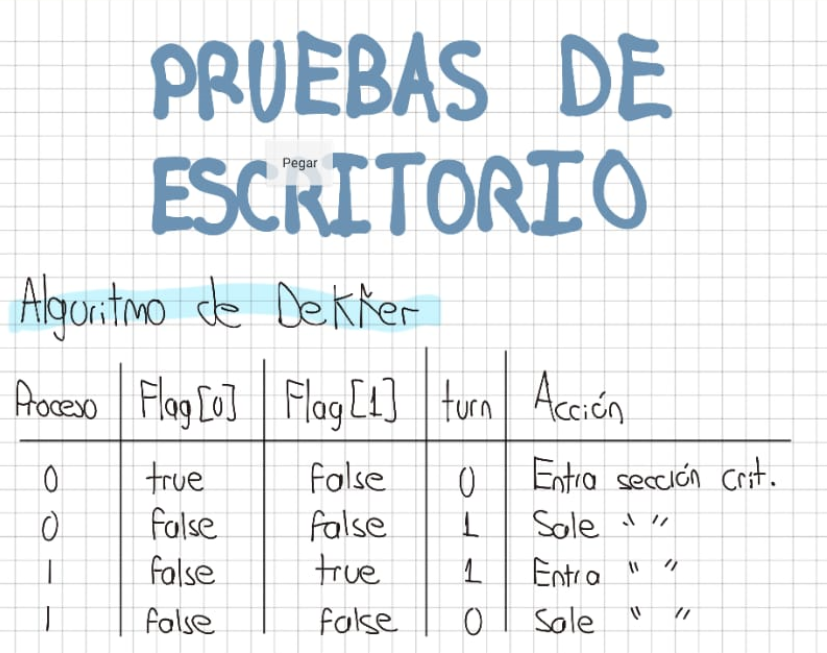
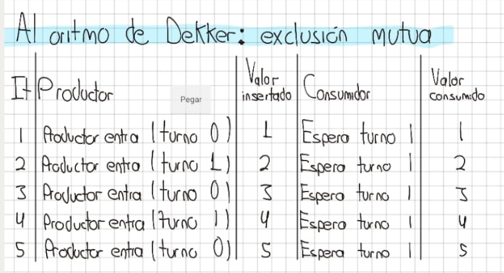
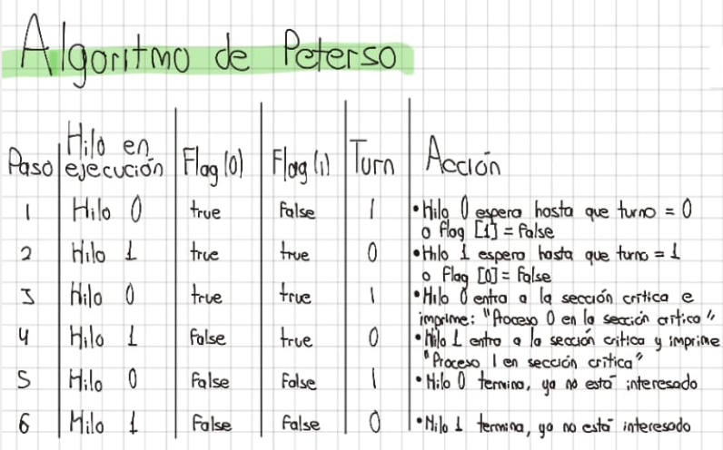
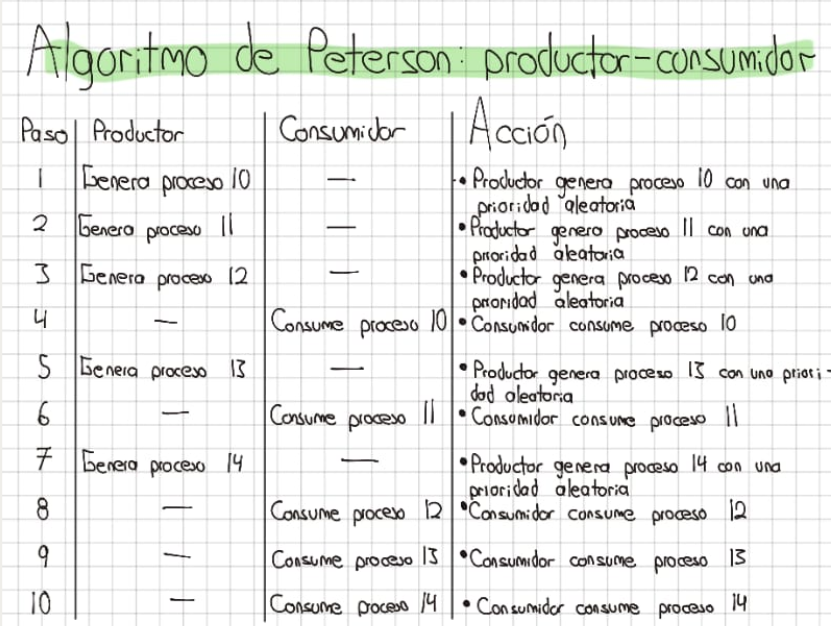

# PRUEBAS DE ESCRITORIO

## Algoritmo de Dekker

Secuencia de ejecución:

Inicio de main:

* Se crean los hilos t0 y t1, y se les asignan los identificadores id0 = 0 e id1 = 1, respectivamente.
* Se lanzan ambos hilos y se les pasa como argumento sus respectivos identificadores (0 o 1).

Ejecución de proceso(0) (hilo t0):

* El hilo 0 entra en la función proceso() con el valor i = 0.
* flag[0] = true (proceso 0 muestra su interés en entrar a la sección crítica).
* Se calcula j = 1 - 0 = 1, por lo que j = 1 (proceso 1).
* El hilo 0 entra en el ciclo while (flag[j]), pero en este caso, flag[1] es false, ya que el proceso 1 aún no ha empezado a ejecutarse.
* El hilo 0 procede sin entrar en el bloque if (turn != i) y entra directamente en la sección crítica: Imprime: "Proceso 0 en sección crítica".
* turn = j = 1 (ahora el proceso 1 tiene la prioridad para entrar a la sección crítica).
* flag[0] = false (proceso 0 ha terminado y ya no está interesado en la sección crítica).

Ejecución de proceso(1) (hilo t1):

* El hilo 1 entra en la función proceso() con el valor i = 1.
* flag[1] = true (proceso 1 muestra su interés en entrar a la sección crítica).
* Se calcula j = 1 - 1 = 0, por lo que j = 0 (proceso 0).
* El hilo 1 entra en el ciclo while (flag[j]), pero en este caso, flag[0] es false, ya que el proceso 0 ya ha salido de la sección crítica.
* El hilo 1 no entra en el bloque if (turn != i) y entra directamente en la sección crítica: Imprime: "Proceso 1 en sección crítica".
* turn = j = 0 (ahora el proceso 0 tiene la prioridad para entrar a la sección crítica).
* flag[1] = false (proceso 1 ha terminado y ya no está interesado en la sección crítica).

Finalización de main:

* Ambos hilos han ejecutado sus secciones críticas y han terminado.
* Se llama a pthread_join() para esperar a que ambos hilos finalicen antes de terminar el programa.

## Algoritmo de Dekker: exclusión mutua.

Secuencia de ejecución paso a paso:

Inicio de main:

1. Se crean dos hilos: hilo_productor y hilo_consumidor.
2. Se ejecutan simultáneamente las funciones productor() y consumidor() en los respectivos hilos.

Ejecución de productor():

El productor ejecuta un ciclo en el que inserta 5 valores (del 1 al 5) en la lista:

1. Iteración 1 (i = 0):
    * El productor establece interesado[0] = 1 (está interesado en entrar a la sección crítica).
    * Entra al ciclo while (interesado[1]), pero como el consumidor no está interesado (interesado[1] = 0), entra a la sección crítica.
    * Inserta el valor 1 al final de la lista (insertar_final(1)).
    * Después de insertar, el productor cede el turno al consumidor con turno = 1.
    * Desactiva su interés en la sección crítica con interesado[0] = 0.
    * Duerme por 1 segundo (sleep(1)).

2. Iteración 2 (i = 1):

    * El productor repite el proceso: establece interesado[0] = 1, verifica si el consumidor está interesado (no lo está), inserta el valor 2 (insertar_final(2)), cede el turno, y duerme por 1 segundo.

3. Iteraciones 3-5 (i = 2 a i = 4):

    * El productor repite lo mismo, insertando los valores 3, 4 y 5 en la lista.

Ejecución de consumidor():

El consumidor ejecuta un ciclo en el que consume 5 valores de la lista:

1. Iteración 1 (i = 0):

    * El consumidor establece interesado[1] = 1 (está interesado en entrar a la sección crítica).
    * Entra al ciclo while (interesado[0]). Como el productor está interesado (interesado[0] = 1), el consumidor espera hasta que el turno sea suyo (turno = 1).
    * Cuando el turno es 1, el consumidor entra a la sección crítica y consume el valor 1 (llama a atender_proceso()).
    * Cede el turno al productor con turno = 0 y desactiva su interés con interesado[1] = 0.
    * Duerme por 1 segundo (sleep(1)).

2. Iteración 2 (i = 1):

    * El consumidor repite el proceso: establece interesado[1] = 1, espera hasta que el turno sea 1, consume el valor 2, cede el turno, y duerme por 1 segundo.

3. Iteraciones 3-5 (i = 2 a i = 4):

    * El consumidor repite el proceso, consumiendo los valores 3, 4 y 5.

## Algoritmo de Peterson

Inicialización:

* flag[0] = false, flag[1] = false (ningún hilo está interesado inicialmente).
* turn = 0 (el hilo 0 tiene el turno inicial).

Ejecución de main:

1. Se crean dos hilos: t0 (para el proceso 0) y t1 (para el proceso 1).
2. Ambos hilos ejecutan la función proceso(), pasando id0 = 0 y id1 = 1 como argumentos respectivos.

Ejecución de proceso(0) (hilo t0):

1. Hilo 0 ejecuta proceso() con i = 0 y j = 1.
    * Establece flag[0] = true (hilo 0 está interesado).
    * Establece turn = 1 (le toca al hilo 1, de acuerdo al valor de j).
2. Entra en el bucle while (flag[1] && turn == 1):
    * El hilo 0 espera hasta que el hilo 1 no esté interesado o su turno llegue.
    * Como turn = 1, el hilo 0 espera que el hilo 1 termine su sección crítica (si está interesado).

Ejecución de proceso(1) (hilo t1):

1. Hilo 1 ejecuta proceso() con i = 1 y j = 0.
    * Establece flag[1] = true (hilo 1 está interesado).
    * Establece turn = 0 (le toca al hilo 0, de acuerdo al valor de j).
2. Entra en el bucle while (flag[0] && turn == 0):
    * El hilo 1 espera hasta que el hilo 0 no esté interesado o su turno llegue.
    * Como turn = 0, el hilo 1 espera que el hilo 0 termine su sección crítica (si está interesado).

## Algoritmo de Peterson: productor - consumidor

1. Inicialización:

    * choosing[NUM_PROCESOS] = {false, false, false}
    * number[NUM_PROCESOS] = {0, 0, 0}

2. Primer ciclo (proceso(0)):

    * El hilo 0 entra en la fase de elección de número: choosing[0] = true.
    * Asigna number[0] = 1.
    * El hilo 0 recorre los demás procesos (1 y 2). No cambia su número, ya que los otros procesos tienen número 0.
    * Establece choosing[0] = false para indicar que ya ha terminado de elegir el número.
    * Entra en la fase de espera. No tiene que esperar porque su número es el menor.
    * Accede a la sección crítica y muestra: "Proceso 0 en sección crítica".
    * Sale de la sección crítica y establece number[0] = 0.

3. Segundo ciclo (proceso(1)):

    * El hilo 1 entra en la fase de elección de número: choosing[1] = true.
    * Asigna number[1] = 1.
    * El hilo 1 recorre los demás procesos. El número de proceso(0) es 0, por lo que no cambia su número.
    * Establece choosing[1] = false para indicar que ha terminado de elegir el número.
    * Entra en la fase de espera. El número de proceso(0) es 0, y como number[1] > number[0], puede acceder a la sección crítica.
    * Accede a la sección crítica y muestra: "Proceso 1 en sección crítica".
    * Sale de la sección crítica y establece number[1] = 0.

4. Tercer ciclo (proceso(2)):

    * El hilo 2 entra en la fase de elección de número: choosing[2] = true.
    * Asigna number[2] = 1.
    * El hilo 2 recorre los demás procesos. Los números de proceso(0) y proceso(1) son ambos 0, por lo que no cambia su número.
    * Establece choosing[2] = false para indicar que ha terminado de elegir el número.
    * Entra en la fase de espera. Los números de proceso(0) y proceso(1) son menores, por lo que el hilo 2 accede a la sección crítica.
    * Accede a la sección crítica y muestra: "Proceso 2 en sección crítica".
    * Sale de la sección crítica y establece number[2] = 0.

